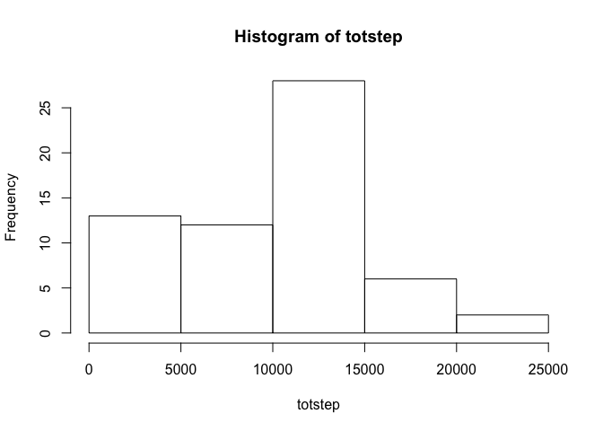
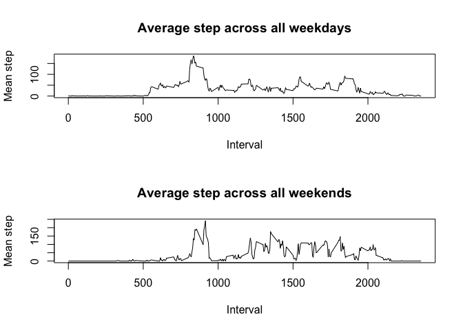

# Reproducible Research: Peer Assessment 1

## Loading and preprocessing the data

1. Set the working directory, and load data to 'activity'


```r
setwd("~/Coursera/JHDataScience/Course5_RR/Week2")
activity <- read.csv("activity.csv", header=T)
```

2. Change 'interval' column into factor variable


```r
activity$interval <- as.factor(activity$interval)
```

## What is mean total number of steps taken per day?
### You can ignore missing values.

1. Calculate the total number of steps taken per day


```r
totstep <- tapply(activity$steps, activity$date, sum, na.rm=TRUE)
```

2. Create a histogram 


```r
hist1 <- hist(totstep, main="Total number of steps taken each day", xlab="")
```

<!-- -->

```r
plot(hist1)
```

<!-- -->

3. Calculate and report the mean and median of the total number of steps taken per day


```r
mean(totstep) ; median(totstep)
```

```
## [1] 9354.23
```

```
## [1] 10395
```

## What is the average daily activity pattern?

1. Make a time series plot of the 5-minute interval (x-axis) and the average number of steps taken, averaged across all days (y-axis)


```r
meanstep <- tapply(activity$steps, activity$interval, 
                mean, na.rm=TRUE)
interval <- as.integer(levels(activity$interval))

plot(interval, meanstep, type="l", 
     main="Time Series Plot ; interval",
     xlab="5-minute Interval",
     ylab="Average numbers of Steps")
```

<!-- -->

2. Which 5-minute interval, on average across all the days in the dataset, contains the maximum number of steps?


```r
which(meanstep==max(meanstep))
```

```
## 835 
## 104
```
- 835~840 interval has the maximum number of steps.


## Imputing missing values
### Note that there are a number of days/intervals where there are missing values (coded as NA). The presence of missing days may introduce bias into some calculations or summaries of the data.

1. Calculate and report the total number of missing values in the dataset.


```r
sum(is.na(activity$steps))
```

```
## [1] 2304
```
- There are 2304 missing values.

2. Devise a strategy for filling in all of the missing values in the dataset. The strategy does not need to be sophisticated. For example, you could use the mean/median for that day, or the mean for that 5-minute interval, etc.


```r
mean(activity$steps, na.rm=TRUE) ; median(activity$steps, na.rm=TRUE)
```

```
## [1] 37.3826
```

```
## [1] 0
```
- I thought that, if we change NAs into mean value, the all data will have too much upward leveling. So I choose median instead of mean to replace NAs

3. Create a new dataset that is equal to the original dataset but with the missing data filled in.


```r
newactivity <- activity
newactivity$steps[which(is.na(newactivity$steps))] <- median(newactivity$steps, na.rm=TRUE)
```


4. Make a histogram of the total number of steps taken each day and Calculate and report the mean and median total number of steps taken per day. Do these values differ from the estimates from the first part of the assignment? What is the impact of imputing missing data on the estimates of the total daily number of steps?


```r
newtotstep <- tapply(newactivity$steps, newactivity$date, sum)
hist2 <- hist(newtotstep, main="Total number of steps taken each day ; Imputed", xlab="")
```

<!-- -->

```r
plot(hist2)
```

<!-- -->
- Because all NA values turned into 0, it seems little difference in histogram.


```r
hist1$counts==hist2$counts
```

```
## [1] TRUE TRUE TRUE TRUE TRUE
```
- Actually, there's no difference between non-imputed and imputed dataset. 


```r
totstep==newtotstep
```

```
## 2012-10-01 2012-10-02 2012-10-03 2012-10-04 2012-10-05 2012-10-06 
##       TRUE       TRUE       TRUE       TRUE       TRUE       TRUE 
## 2012-10-07 2012-10-08 2012-10-09 2012-10-10 2012-10-11 2012-10-12 
##       TRUE       TRUE       TRUE       TRUE       TRUE       TRUE 
## 2012-10-13 2012-10-14 2012-10-15 2012-10-16 2012-10-17 2012-10-18 
##       TRUE       TRUE       TRUE       TRUE       TRUE       TRUE 
## 2012-10-19 2012-10-20 2012-10-21 2012-10-22 2012-10-23 2012-10-24 
##       TRUE       TRUE       TRUE       TRUE       TRUE       TRUE 
## 2012-10-25 2012-10-26 2012-10-27 2012-10-28 2012-10-29 2012-10-30 
##       TRUE       TRUE       TRUE       TRUE       TRUE       TRUE 
## 2012-10-31 2012-11-01 2012-11-02 2012-11-03 2012-11-04 2012-11-05 
##       TRUE       TRUE       TRUE       TRUE       TRUE       TRUE 
## 2012-11-06 2012-11-07 2012-11-08 2012-11-09 2012-11-10 2012-11-11 
##       TRUE       TRUE       TRUE       TRUE       TRUE       TRUE 
## 2012-11-12 2012-11-13 2012-11-14 2012-11-15 2012-11-16 2012-11-17 
##       TRUE       TRUE       TRUE       TRUE       TRUE       TRUE 
## 2012-11-18 2012-11-19 2012-11-20 2012-11-21 2012-11-22 2012-11-23 
##       TRUE       TRUE       TRUE       TRUE       TRUE       TRUE 
## 2012-11-24 2012-11-25 2012-11-26 2012-11-27 2012-11-28 2012-11-29 
##       TRUE       TRUE       TRUE       TRUE       TRUE       TRUE 
## 2012-11-30 
##       TRUE
```
- In this dataset, if there's at least one missing value in one day, that day's data are ALL missing value. Therefore, imputing(median) doesn't affect much to 'daily' step.

- But it doesn't mean that we should use mean instead of median, becuase mean is so big that it will do enormous upward leveling.


```r
mean(totstep);median(totstep);mean(newtotstep);median(newtotstep)
```

```
## [1] 9354.23
```

```
## [1] 10395
```

```
## [1] 9354.23
```

```
## [1] 10395
```
- Those are same, as mentioned above.

## Are there differences in activity patterns between weekdays and weekends?
### For this part the weakdays() function may be of some help here. Use the dataset with the filled-in missing values for this part.

1. Create a new factor variable in the dataset with two levels -  "weekday" and "weekend" indicating whether a given date is a weekday or weekend day.


```r
date <- as.POSIXlt(newactivity$date)
a <- c()        #empty vector
for(i in 1:nrow(newactivity)){
        if(weekdays(date[i])=="Saturday" | weekdays(date[i])=="Saturday")
                a[i] <- "weekend"
        else
                a[i] <- "weekday"
}
a <- as.factor(a)
```
- vector a indicates whether the given date is a weekday or weekend day.
- 1 indicates a weekend day, and 0 indicates a weekday.

2. Make a panel plot containing a time series plot (i.e. type="l") of the 5-minute interval (x-axis) and the average number of steps taken, averaged across all weekday days or weekend days (y-axis). See the README file in the GitHub repository to see an example of what this plot should look like using simulated data.


```r
newact_ind <- cbind(newactivity, a)
colnames(newact_ind)[ncol(newact_ind)] <- "Indicator"
        # Split by weekend & weekday #
weekday_act <- newact_ind[which(newact_ind$Indicator=="weekday"),]
weekend_end <- newact_ind[which(newact_ind$Indicator=="weekend"),]
        # Calculate each average step #
new_meanstep_day <- tapply(weekday_act$steps, weekday_act$interval, mean)
new_meanstep_end <- tapply(weekend_end$steps, weekend_end$interval, mean)
        # Set interval #
interval <- as.integer(levels(newact_ind$interval))

par(mfrow=c(2,1))
plot(interval, new_meanstep_day, main="Average step across all weekdays",
     ylab="Mean step", xlab="Interval", type="l")
plot(interval, new_meanstep_end, main="Average step across all weekends",
     ylab="Mean step", xlab="Interval", type="l")
```

<!-- -->
